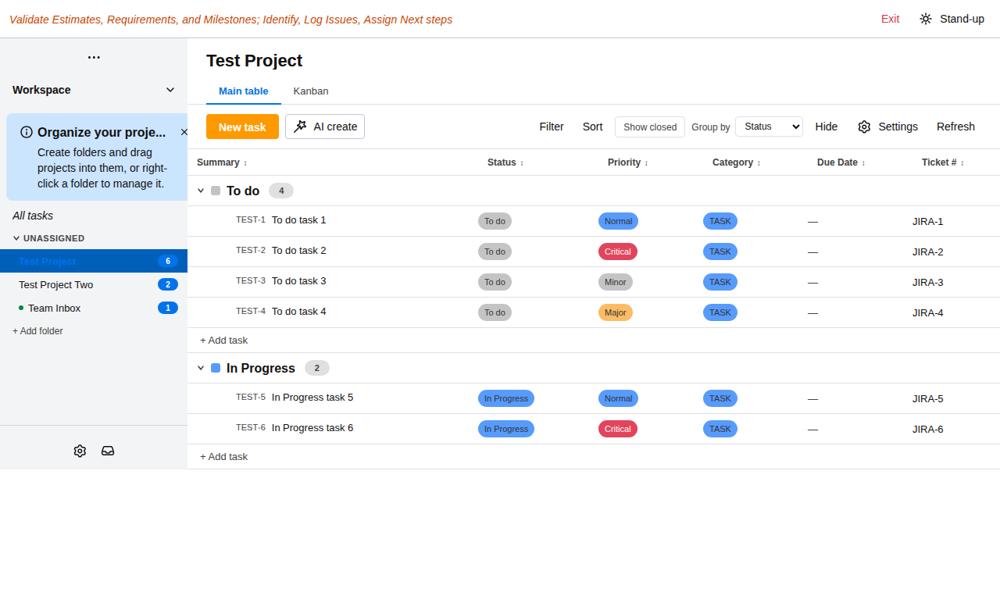
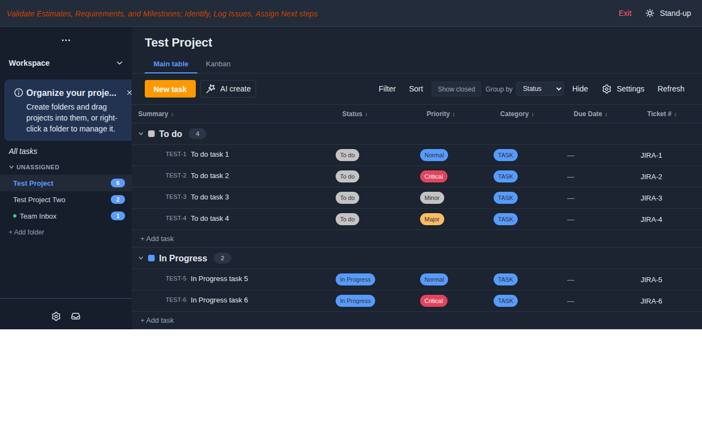
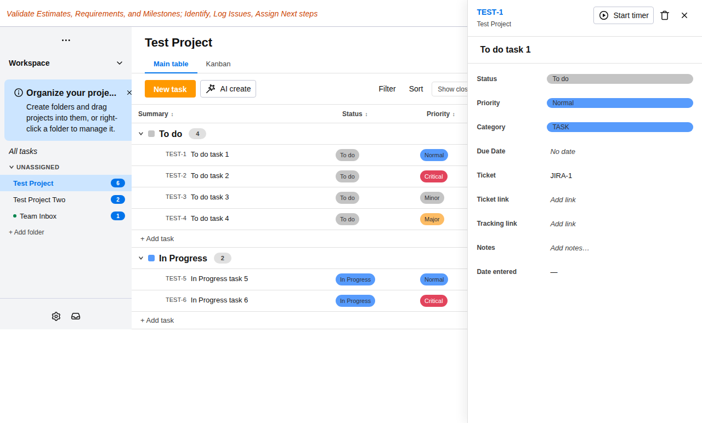
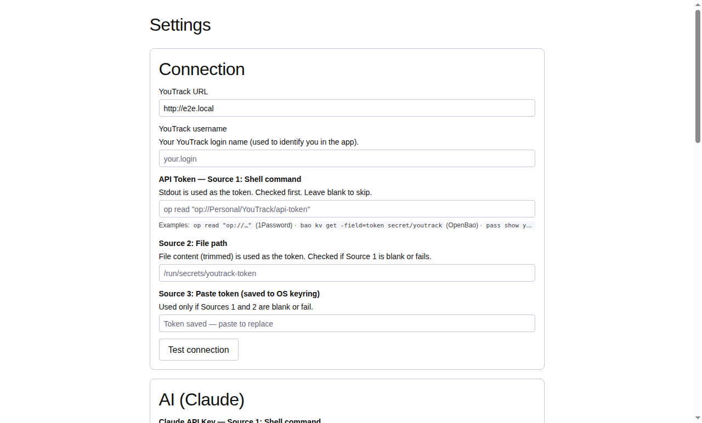

# vermilian

> **V**alidate **E**stimates, **R**equirements, and **M**ilestones; **I**dentify, **L**og **I**ssues, **A**ssign **N**ext steps.

An Electron desktop application that provides an enhanced frontend for a self-hosted [JetBrains YouTrack](https://www.jetbrains.com/youtrack/) instance.

## Status

**Early development — not yet released.** Vermilian is in active development and is not yet
feature-complete or packaged for general use. Expect rough edges and breaking changes; there are
no published releases yet.

- **Design:** complete — feature specs, Architecture Decision Records (ADRs), wireframes, and the
  component architecture are in place.
- **Implemented so far:** the app shell and process architecture (main / preload / renderer with a
  secure IPC bridge), encrypted local credential storage, the YouTrack REST client, and the
  first-run settings and connection flow.
- **In progress:** the task and project board views that make up the core day-to-day interface.

## What it is

Vermilian is a cross-platform desktop app that connects to your self-hosted YouTrack via its REST API and provides a focused, opinionated interface for daily task and project management. YouTrack is the backend and source of truth; Vermilian is the client.

## Screenshots

> Captured against built-in demo data — no real YouTrack instance required.

**Task board** — grouped by status, with priority and category chips:



**Dark theme:**



**Task detail panel** — inline field editing and a built-in timer:



**Settings** — the Connection section, with layered credential sources (shell command, file path, or OS keyring):



## Target platforms

| Platform | Architecture |
|---|---|
| Linux (Fedora / Ubuntu) | x86_64 |
| macOS | x86_64 + ARM (Apple Silicon) |
| Windows 11 | x86_64 |
| Raspberry Pi OS | ARM64 |

## Tech stack

| Layer | Choice |
|---|---|
| App shell | Electron (electron-forge) |
| UI framework | React 18 + TypeScript |
| Design system | [monday.com Vibe](https://style.monday.com) — React component library for monday.com-style UI |
| Package manager | pnpm |
| Diagramming | D2, Mermaid (Kroki) |

## Local development

The app lives in `app/`. The toolchain is pinned by `mise.toml` (Node 24.15.0); **pnpm comes from corepack**, not the system. Neither is active in a stock non-interactive shell, so each session needs the mise node bin on `PATH`:

```bash
# one-time
mise trust                 # trust the pinned mise.toml
mise install               # install Node 24.15.0
corepack enable pnpm       # enable pnpm 11 (uses the mise node)

# every session
export PATH="$HOME/.local/share/mise/installs/node/24.15.0/bin:$PATH"
```

Then, from `app/`:

```bash
pnpm install
pnpm start                       # run app in development (Electron + Vite HMR)
pnpm lint                        # ESLint
pnpm package                     # electron-forge bundle (no GUI needed)
./node_modules/.bin/tsc --noEmit # type-check only
```

System `/usr/bin/node` on Fedora is v22 — too old. Always use the mise-managed v24.

**pnpm 11.5 config gotcha:** `block-exotic-subdeps=false` in `app/.npmrc` is silently ignored by pnpm 11.5+ and `pnpm add` fails with `ERR_PNPM_EXOTIC_SUBDEP` on `@electron/rebuild`'s git subdep. The canonical form is `blockExoticSubdeps: false` in `app/pnpm-workspace.yaml`, mirroring how `nodeLinker` is configured there. The `.npmrc` line is kept as a legacy marker.

## Look and feel

Vermilian targets a **monday.com-style** visual experience: high-density boards, strong colour-coded status and priority chips, left-rail navigation, and inline editing without full-page reloads. The [monday.com Vibe Design System](https://style.monday.com) provides the React component library, theming tokens, and accessibility guidelines used throughout the app.

## Tuning dark mode colours

Theme colours are defined in `app/src/renderer/theme.ts`. Two independent palettes let the left nav and the main board have different text colours:

| Variable | Where it applies |
|---|---|
| `--nav-header-text-color` | Left rail — workspace name, "All tasks" link |
| `--nav-primary-text-color` | Left rail — project names |
| `--nav-secondary-text-color` | Left rail — folder names, issue-count badges |
| `--primary-text-color` | Board — task titles, column headers |
| `--secondary-text-color` | Board — issue IDs, secondary labels |

To tune colours live without editing source, use the Electron DevTools colour picker:

1. Run the app (`pnpm start` from `app/`).
2. Press **Cmd+Option+I** (macOS) or **Ctrl+Shift+I** (Linux/Windows) to open DevTools.
3. In the **Elements** panel, find `<style id="vermilian-theme-overrides">`.
4. Click any hex colour value — the browser's built-in colour picker opens.
5. Adjust until satisfied, then copy the final hex values back into `DARK_PALETTE` in `theme.ts`.

## Development approach

Vermilian is built spec-first using **Spec Driven Design (SDD)**. Feature specs in `spec/features/` define what the app must do before any code is written. Claude Code implements against those specs.

See [spec/README.md](spec/README.md) for the full SDD workflow.

## Phases

| Phase | Goal |
|---|---|
| 0 | Dev environment — tools installed, YouTrack API verified |
| 1 | SDD design — specs, wireframes, ADRs, API contracts |
| 2 | Coding — implement from specs |
| 3 | Testing — unit + E2E tests, cross-platform smoke tests |
| 4 | Public release — GitHub migration, CI/CD, first versioned release |

## Implementation notes — current increment

Phase 2 increment 1 (Foundation + Settings) is shipped but has a few known deviations from the specs/wireframes that will be cleaned up in follow-up work:

- **Confirmations are inline `AttentionBox` panels**, not Vibe `Modal` / `AlertDialog`. The Reset-to-defaults confirm is implemented; the **Cancel-with-unsaved-credentials confirm is not yet** (Cancel currently discards immediately).
- **Test connection messages** show the raw API error string rather than the friendly 401-vs-network strings the Settings spec calls for (e.g. *"Invalid token or insufficient permissions."*).
- **Theme switching** toggles `light-app-theme` / `dark-app-theme` classes on the app root div. These are the standard Vibe theme classes, but the visual switch has not been confirmed in a graphical session yet.
- **`blockExoticSubdeps` config moved** (see Local development above) — `app/.npmrc` keeps the legacy entry for older pnpm; pnpm 11.5+ requires the canonical form in `app/pnpm-workspace.yaml`.

## Repository Layout

```
vermilian/
├── app/                    # Electron app root (electron-forge, Vite, React 18, Vibe)
│   ├── src/
│   │   ├── main/           # Electron main process modules
│   │   ├── renderer/       # React renderer — components, hooks, stores, API client
│   │   ├── shared/         # Types and utilities shared across processes
│   │   ├── main.ts         # Electron main process entry
│   │   ├── preload.ts      # Electron preload (contextBridge IPC)
│   │   └── renderer.tsx    # React app entry — mounts <App>
│   ├── forge.config.ts     # electron-forge config
│   ├── vite.*.config.ts    # per-process Vite configs
│   ├── pnpm-workspace.yaml # pnpm compat settings (must not be removed)
│   └── package.json
├── spec/
│   ├── features/           # authoritative feature specs (SDD workflow)
│   └── phases/             # phase-level specs with exit criteria
├── docs/
│   ├── adr/                # Architecture Decision Records
│   ├── architecture/       # D2 component diagrams
│   ├── design/             # D2 / Mermaid UI wireframes
│   └── requirements.md
├── cli/YouTrack/           # planned Go CLI (in progress)
├── mise.toml               # Node 24.15.0 toolchain pin
├── CONTRIBUTING.md
├── LICENSE
├── README.md
└── RUNBOOK.md
```

## Documentation

- [Requirements](docs/requirements.md)
- [SDD specs](spec/README.md)
- [Architecture diagrams](docs/architecture/README.md)
- [UI wireframes](docs/design/README.md)
- [Architecture Decision Records](docs/adr/README.md)

## App icon

The default Electron icon can be replaced by dropping three files into `app/build/` and updating the forge config.

### Image requirements

| Platform | Format | Minimum size |
|---|---|---|
| macOS | `.icns` | 1024×1024 source |
| Windows | `.ico` | 256×256 source (multi-resolution container) |
| Linux | `.png` | 512×512 (1024×1024 recommended) |

Start with a single 1024×1024 PNG and convert to the platform formats. Tools: [Iconset](https://iconset.io) (macOS app), `icotool` (Linux CLI), or the npm package `electron-icon-maker`.

### Wiring it up

**1.** Place the files:

```
app/build/
  icon.icns
  icon.ico
  icon.png
```

**2.** Update `app/forge.config.ts`:

```ts
packagerConfig: {
  asar: true,
  icon: './build/icon',   // no extension — forge picks the right format per platform
},
// ...
new MakerDeb({ options: { icon: './build/icon.png' } }),
new MakerRpm({ options: { icon: './build/icon.png' } }),
```

**3.** Set the runtime window icon in `app/src/main/window.ts` (shown in the taskbar/dock while the app is running, independently of the packaged installer icon):

```ts
new BrowserWindow({
  icon: path.join(__dirname, '../build/icon.png'),
  // ...
})
```

`pnpm start` picks up the window icon immediately; `pnpm make` bakes it into the installer packages.

## Contributing

See [CONTRIBUTING.md](CONTRIBUTING.md) for the PR workflow and diagram conventions.

## License

Copyright © Kevin P. Inscoe.

Vermilian is licensed under the **GNU General Public License v3.0 only** (`GPL-3.0-only`).
You may use, study, share, and modify it under the terms of that license; distributed
modifications must also be released under the GPL-3.0. See the [LICENSE](LICENSE) file for
the full text, or <https://www.gnu.org/licenses/gpl-3.0.html>.
